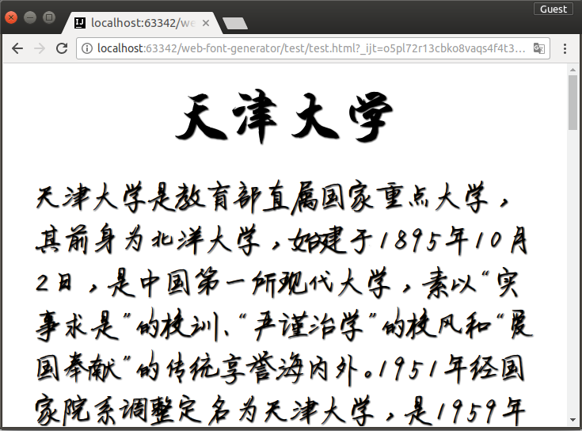

Web Font Generator
==================

Introduction
----------------
Web font generator is a tiny tool to dynamically generate web fonts for CJK(Chinese/Japanese/Korean).

It use the given TTF font(s) to generate minimalized EOT/WOFF/TTF/SVG font-packs and cross-browser compatible `@font-face` CSS depending on the contents scanned from the files you specify.

Its goal is to make embedding CJK fonts in webpages easier dedicatedly for small-scale and static websites (just like github pages).

It use pure java code and libraries to do this job, so it should be cross-platform compatible.

Usage
---------------
The full-packed standalone runnable jar is put in the `dist` folder, you can directly run it without compilation.

```
usage: java -jar webfontgen.jar TTF1 TTF2... [-?] [-c <FILE>] [-d] [-e
       <CHARSET>] [-h] [-i <FILE1,FILE2,...>] [-m] [-o <DIR>] [-s <DIR>]
       [-v] [-x <DIR1,DIR2,...>]

 -?,--help                        Show this help info.
 -c,--css <FILE>                  Specify the filename(and location) of
                                  the generated CSS file. Defaults to
                                  "output\webfonts.css".
 -d,--deep                        (Experimental)Enable deep scanning to
                                  get precise font-text match so as to
                                  make fonts much smaller.
                                  [Notice] If enabled, ensure all related
                                  css files could be accessible(e.g. css
                                  from servers linked by absolute path),
                                  and you'd better add "@charset"
                                  declaration in your css.
 -e,--encode <CHARSET>            Specify the encoding charset for parsing
                                  files. Defaults to "UTF-8".
 -h,--hint                        Keep hint info of the generated
                                  WOFF/EOT/TTF font.
 -i,--include <FILE1,FILE2,...>   Specify files to include for scanning
                                  (wildcard available). Defaults to "*.*".
 -m,--mec                         Enable Microtype Express Compression for
                                  the generated EOT font.
 -o,--out <DIR>                   Dir to store the generated fonts.
                                  Defaults to "output".
 -s,--src <DIR>                   Root dir of your website dir or
                                  workspace dir. Defaults to ".".
 -v,--version                     Show version info.
 -x,--exclude <DIR1,DIR2,...>     Specify which dirs will be skipped
                                  (wildcard available).
```

Test
---------------
Browse into `test` folder, there is a `RunTest.bat` file for Windows. Double-click it to run, then the fonts and css will be generated and you may open the `test.html` file in your favourite browser (but Chrome is recommended) to see the texts decorated with different fonts. 

The rendered page will look like this



Yeah, they are all Chinese... I hope you like it.

Dependencies
----------------
This tool has the following dependency libraries, all of them are open-sourced, and each one has a copy in the `lib` folder for your convenience.

1. Font manipulation
   * [Google sfntly](https://code.google.com/p/sfntly/) 
   * [Apache Batic](https://code.google.com/p/sfntly/)
       * batik-svggen
       * batik-util
2. CSS analyzation
   * [CSSBox](http://cssbox.sourceforge.net)
       * CSSBox
       * jStyleParser
       * sub-dependencies:
           * antlr-runtime 3.1
           * nekohtml
           * xercesImpl
           * log4j 1.2.17
           * slf4j-api 1.6.6
           * slf4j-log4j12 1.6.6
3. Other Common libs
   * commons-io 2.4
   * commons-cli 1.3-snapshot

Issues
--------------
You are welcome to put issues in the [issues page](https://github.com/tjumyk/web-font-generator/issues), I hope this can be better and better.

License
--------------
This tool is licesed under [Apache License Version 2.0](http://apache.org/licenses/LICENSE-2.0.html), so you are free to use it.
